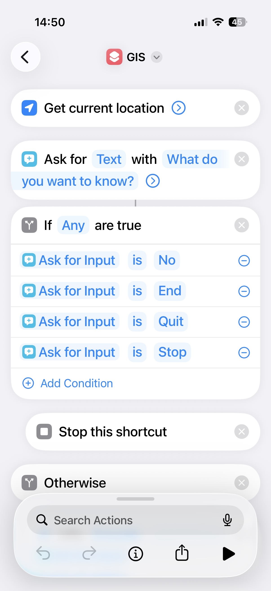
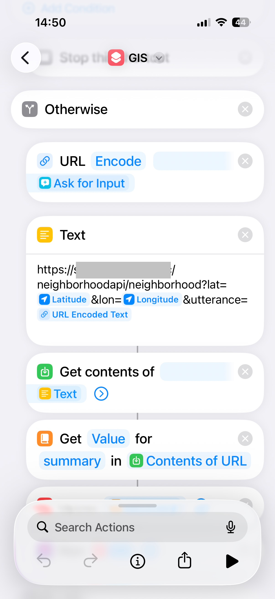
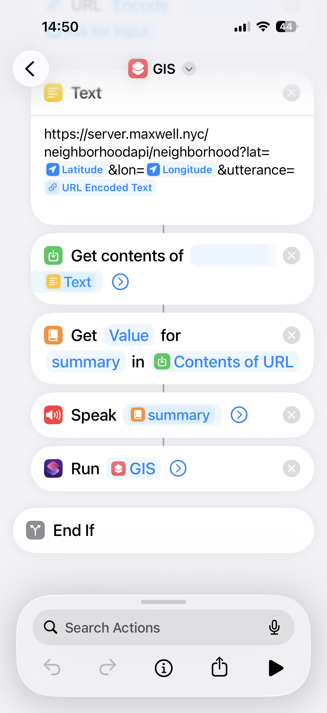

# Neighborhood Info

An API that answers "what's around here?" for wherever you're currently driving. Trigger it from a Siri Shortcut with your lat/long and get back a short, spoken-readable sentence about the area — housing values, demographics, crime, election results, or local history.

> **Status: the full stack runs, publicly.** Dataset ingestion, the Postgres/PostGIS database, the FastAPI service (containerized, DeepSeek-powered spoken commentary), the live Wikipedia/Wikidata history lookup, and public HTTPS exposure (via an existing homelab Caddy reverse proxy) are all built and tested end to end — see `ingestion/`, `db/`, `api/`, and the sections below. Beyond the original plan: population density, education attainment, FEMA natural hazard risk, NCES school characteristics, EPA walkability/built-environment data, and rapid-fire stat comparisons against your state, the national average, or NYC. See [`CLAUDE.md`](./CLAUDE.md) for the full architecture and [`research.md`](./research.md) for the data-source research behind it.

## Why

Commercial neighborhood-data APIs (ATTOM, NeighborhoodScout, Local Logic, etc.) are priced for real-estate SaaS, not a hobby project, and none of them cover election data. This project builds the same kind of lookup out of free, publicly available government and nonprofit data instead — nationwide, self-hosted, no per-request vendor cost.

## How it works

1. A Siri Shortcut sends your current lat/long to the API.
2. The API resolves that point to a Census tract/county/place locally (PostGIS point-in-polygon lookup — no live geocoding call).
3. It looks up pre-loaded data for that location and returns a short sentence plus structured data.

Data is **pulled and stored locally**, not queried from external APIs on every request. A batch job, run manually roughly once a year, refreshes the whole dataset for the entire USA from free bulk sources.

## Data sources & how they're pulled

Every source downloads with a script — no browser required, except crime, where the FBI's interactive app has no scriptable download endpoint at all:

| Category | Source | Script | Manual step needed |
|---|---|---|---|
| Boundaries (tract/county/place) | Census TIGER/Line | `ingestion/download_tiger.py` | None |
| Home values | Zillow ZHVI | `ingestion/download_zhvi.py` | None |
| Rent levels | Zillow ZORI | `ingestion/download_zori.py` | None |
| Historic sites | National Register of Historic Places (NPS) | `ingestion/download_nrhp.py` | None |
| Demographics, tenure (rental %), housing type mix, median year built | Census ACS 5-year | `ingestion/download_acs.py` | Free API key — [signup](https://api.census.gov/data/key_signup.html) (instant), put in `ingestion/.env` |
| Crime | FBI NIBRS master file (incident-level, all agencies, one year) | `ingestion/download_fbi_crime.py --check`, then `ingestion/parse_nibrs.py` | Download is fully manual — no scriptable endpoint exists (the interactive CDE app's downloads are behind a protected endpoint). Get `nibrs-<year>.zip` and `nibrs-help.zip` (record layout doc) from [the CDE downloads page](https://cde.ucr.cjis.gov/LATEST/webapp/#/pages/downloads) and drop into `datasets/fbi_crime/`. **Parsing is scripted**: `parse_nibrs.py` streams the multi-GB fixed-width file (never loads it into memory) and aggregates it to county-level offense counts — see its docstring for the record layout this relies on. |
| Elections (2024 presidential, county-level) | [tonmcg/US_County_Level_Election_Results_08-24](https://github.com/tonmcg/US_County_Level_Election_Results_08-24) (GitHub mirror; MEDSL's own Harvard Dataverse blocks all scripted access, see script docstring) | `ingestion/download_elections.py` | None |
| ZIP code centroids (for resolving a ZIP to a lat/long, e.g. "compare to home") | Census Gazetteer ZCTA file | `ingestion/download_zcta.py` | None |
| Local crime supplement (NYC only — one-off exception, see below) | NYC Open Data / NYPD complaint data (Socrata) | `ingestion/download_nypd_crime.py` | None |
| Historic summary / notable people & events | Wikipedia / Wikidata | `api/wikipedia.py` — not a batch script, called live by the API and cached per location in `history_cache` | None |
| Population density, education attainment | Census TIGER (`ALAND`) / ACS (already-pulled sources, no new script) | `ingestion/download_tiger.py`, `ingestion/download_acs.py` | None |
| Natural hazard risk (18 hazard types) | FEMA National Risk Index | `ingestion/download_fema_nri.py --check` | Download is fully manual — FEMA's site blocks every scripted fetch attempted (confirmed: Akamai `Access Denied` on every path tried, and NRI isn't in the OpenFEMA API's dataset catalog at all — see `CLAUDE.md`). Get the tract-level CSV (`NRI_Table_CensusTracts.zip`) from [hazards.fema.gov/nri/data-resources](https://hazards.fema.gov/nri/data-resources) and unzip into `datasets/fema_nri/`. |
| School characteristics (enrollment, staffing, poverty proxy — not quality ratings) | NCES Common Core of Data | `ingestion/download_nces_ccd.py` | None |
| Walkability, density, transit access | EPA Smart Location Database | `ingestion/download_epa_sld.py` | None |

Note: we initially assumed FBI crime data would end up state-level only (the easy download is a small state/national estimates file) — see `CLAUDE.md` for why we upgraded to the full incident-level NIBRS file instead, which gets us real county-level counts. Running it against the 2025 file: 70M lines / 13.3M offense records parsed in ~2.5 minutes, covering 2,899 of ~3,143 US counties (92% — matches known NIBRS agency participation gaps).

Setup:

```
cd ingestion
python3 -m venv .venv
.venv/bin/pip install -r requirements.txt
cp .env.example .env   # fill in CENSUS_API_KEY
.venv/bin/python download_tiger.py
.venv/bin/python download_zhvi.py
.venv/bin/python download_zori.py
.venv/bin/python download_nrhp.py
.venv/bin/python download_acs.py
.venv/bin/python download_elections.py
.venv/bin/python download_zcta.py
.venv/bin/python download_nypd_crime.py
.venv/bin/python parse_nibrs.py 2025   # after manually dropping nibrs-2025.zip + nibrs-help.zip into datasets/fbi_crime/
.venv/bin/python download_nces_ccd.py
.venv/bin/python download_epa_sld.py   # ~200MB
.venv/bin/python download_fema_nri.py  # prints manual-download steps -- FEMA's site blocks scripted fetches
```

Downloaded files land in `datasets/` (gitignored — it's ~1GB and growing, not meant to be committed).

## Database

```
docker compose up -d                                    # starts Postgres/PostGIS on localhost:5432
ingestion/.venv/bin/python -m db.load                    # from repo root: loads everything from datasets/
ingestion/.venv/bin/python test_lookup.py <lat> <lon>    # try a location
```

`db/load.py` does a full drop-and-reload every run (~364k geography rows including block groups, 85k tract-level demographics rows, 92k historic sites, 99k schools, 221k built-environment block groups, etc. — a few minutes). `db/queries.py` is the query library the `api` service calls directly (`resolve_location`, `get_demographics`, `get_home_values`, `get_crime`, `get_crime_rate`, `get_crime_by_category`, `get_elections`, `get_historic_sites`, `get_hazard_risk`, `get_nearby_schools`, `get_built_environment`, `get_neighborhood_summary`, `resolve_zip`, `compare_to_home`, `get_local_crime`, `get_local_crime_rate`, `get_local_crime_by_category`) — every function returns plain dicts, no ORM objects. `get_demographics` also derives `population_density` and `bachelors_or_higher_pct` at query time now, same pattern as `renter_pct`. Originally built so a template engine could generate the spoken sentence deterministically; the API ended up using DeepSeek for that instead (see below), so the real payoff of "every field is precomputed, not a raw count" turned out to be keeping the LLM from doing its own arithmetic, not powering a template.

`compare_to_home(lat, lon, home_zip="10002")` compares any location against a fixed home ZIP's stats (income, rent, home value, renter %, crime rate, 2024 election). Finding this surfaced immediately: NYC's own crime data isn't reliable enough to compare against — all 5 boroughs combined show 2 recorded incidents for all of 2025 in the FBI's NIBRS file (NYPD hasn't meaningfully transitioned to NIBRS reporting), versus hundreds of thousands for LA/Chicago/Houston. `get_crime_rate` and `compare_to_home` both detect and suppress this (`MIN_RELIABLE_INCIDENTS` in `db/queries.py`) rather than silently producing something like "2,000,000% higher than home."

The election comparison is a percentage-**point** difference in two-party GOP vote share (`political_lean`: e.g. "35.3 points more Republican than home"), not a relative percent change — a relative % of a % isn't a meaningful statement, but a point difference on the shared 0-100 GOP-share scale is. Kept separate from the plain same-party boolean (`same_winning_party_2024`), which is still useful on its own.

Since NIBRS is unusable for NYC, `ingestion/download_nypd_crime.py` pulls real complaint-level data instead, straight from NYC Open Data (the actual source behind CompStat) — 1,731 real 2025 complaints for all of Manhattan (New York County), no auth needed. Whole-county, not a ZIP radius (an earlier version was radius-based and had a confirmed-inflated population estimate; NYC's boroughs map 1:1 to counties, so filtering NYPD's own borough field and using the real Census county population is both simpler and exact). Kept as a separate `home_local_crime` field in `compare_to_home`'s output rather than merged into the main comparison, since it's still a genuinely different counting methodology (NYPD complaints vs. NIBRS offense records) — not something to present as a precise percentage against the target. This is a deliberately scoped, one-off exception for NYC, not a general per-city data source (the architecture explicitly avoids that — too high-maintenance to do nationwide).

`compare_to_home`'s `crime_by_category` breaks the crime comparison down by type (assault, drug, larceny, burglary, etc.) — target's rate vs. state, national, and home, per category. Doing this required mapping two completely different offense-classification systems (NIBRS codes and NYPD's free-text categories) to one shared list. Building it surfaced a real problem worth knowing about: home's own category counts can be tiny even when its overall crime count is fine (Manhattan's pulled data: 1 kidnapping complaint all year, 3 weapons, 3 arson) — comparing a normal target count against a home count of 1-3 produced nonsense like "+36,000% vs. home." Fixed with a `MIN_CATEGORY_INCIDENTS = 10` floor: below it, that category's home comparison is `None` rather than a number.

**Performance**: `compare_to_home` was taking ~10 seconds — traced to a spatial index that existed but was never actually used (`db/load.py` indexed the plain `geometry` column, but the slow queries all cast to `::geography` for accurate meter-based distance, and Postgres won't use a plain-geometry index for a `::geography`-cast query). Added a matching expression index (`GIST ((geometry::geography))`) for both `geographies` and `historic_sites`. Confirmed via `EXPLAIN ANALYZE`: 8,831ms → 8.8ms for the population lookup alone; `compare_to_home` end-to-end: 10.4s → 0.16s.

Tested against three real coordinates end to end — one result worth calling out: a point in Oberlin, OH independently comes back with median age 21.4, 27% renter-occupied, *and* "Oberlin College" as the nearest historic site (248m away) — three unrelated data sources (Census demographics, TIGER boundaries, NRHP) agreeing with each other and with reality, not synthetic test data. Full details and all three results in CLAUDE.md's "Database & query library" section.

## API

Built, containerized, and running:

```
cp .env.example .env   # fill in DEEPSEEK_API_KEY; API_KEY can be any random string, it's this API's own auth
docker compose up -d --build
```

Each category is its own endpoint, so a Siri Shortcut can call one fixed URL:

```
GET /neighborhood?lat=&lon=                          full summary across all categories
GET /neighborhood/housing?lat=&lon=
GET /neighborhood/demographics?lat=&lon=
GET /neighborhood/crime?lat=&lon=
GET /neighborhood/elections?lat=&lon=
GET /neighborhood/history/sites?lat=&lon=             NRHP historic sites (no live call needed)
GET /neighborhood/compare?lat=&lon=&home_zip=10002    vs. a home ZIP -- income, rent, crime, politics
GET /neighborhood/history?lat=&lon=                   nearby Wikipedia places/topics, live call, cached
GET /neighborhood/history/events?lat=&lon=            same, filtered to events
GET /neighborhood/history/people?lat=&lon=            same, filtered to people
GET /neighborhood/hazards?lat=&lon=                   FEMA natural hazard risk, 85,154 tracts loaded
GET /neighborhood/schools?lat=&lon=                   nearby public school characteristics (not ratings)
GET /neighborhood/walkability?lat=&lon=               EPA walkability, density, transit access
GET /neighborhood/compare/state?lat=&lon=             rapid-fire stat comparison to the state average
GET /neighborhood/compare/national?lat=&lon=          rapid-fire stat comparison to the national average
GET /neighborhood?lat=&lon=&utterance=housing         free-text intent routing, e.g. "housing", "tell me
                                                       about crime here", "compare to home", "compare to
                                                       the state", "compare to NYC", "everything"
```

`utterance` is meant for a Siri Shortcut that passes dictated speech straight through, instead of hardcoding one category's URL per shortcut. DeepSeek classifies the free text into one or more of `demographics`/`housing`/`crime`/`elections`/`history`/`compare`/`hazards`/`schools`/`walkability`/`everything` (`api/llm.py`'s `classify_intent`), the response only includes data for those categories (plus a `requested_categories` field showing what was inferred), and `everything` gets a noticeably longer narration than a single-category ask (~2,600 vs. ~450 characters, measured). A vague or unparseable utterance falls back to `everything` rather than guessing narrowly. Omit `utterance` and `/neighborhood` behaves exactly as it always has.

Ask `utterance=help` (or anything like "what can I ask") for a concise keyword-style rundown of what this API understands (e.g. `"Topics: demographics, housing, crime, ..., everything."`) — a fixed, non-LLM-generated string, so it can't describe a capability that doesn't exist. Works even when the coordinates can't be resolved to a location, since it doesn't need one.

All require an `X-API-Key` header (confirmed: missing/wrong key → 401). Every response is `{"summary": "...", "data": {...}}`. `data` is `db/queries.py`'s output, unchanged. `summary` is real DeepSeek commentary (`?commentary=false` skips the LLM call if you just want the raw data faster/free) — for example, hitting `/neighborhood/compare` for a point in Oberlin, OH against home ZIP 10002 produced:

> *"You're in Oberlin, Ohio, and this place is a real outlier. It's a college town with a median age of just 21, which is strikingly younger than your home in New York City, where the median age is about 55. Home values here are also a fraction of what you're used to, sitting around 266,000 dollars compared to over 1.2 million back home. Politically, this area leans more Republican than your home turf, with about 53 percent of voters going for the GOP in 2024, compared to just 18 percent in your part of Manhattan. Crime rates here are actually lower than both the state and national averages across most categories, though they're still higher than what you'd see in your home neighborhood."*

Checked against the underlying data — accurate on every number. This is a deliberate departure from the original "deterministic template" plan for `summary` (see CLAUDE.md) — the model only narrates, using `db/queries.py`'s already-computed stats (`renter_pct`, `margin_pct`, `vs_state_pct`, etc.), never doing its own math.

`/neighborhood/history` and its `/events`/`/people` sub-routes are live too now — `api/wikipedia.py` calls Wikipedia's GeoSearch API (distance-ordered nearby places) plus a Wikidata SPARQL query to classify each result as a person/event/site, caching the result in `history_cache` so a given location is only fetched once. Tested against Oberlin, OH (20 real results — the college, historic churches, a former train station) and Gettysburg, PA. One live finding: the Wikidata classification step hit a real `query.wikidata.org` outage/rate-limit during testing (`HTTP 429`) — it degrades gracefully (results still come back, just tagged `"other"` instead of the correct category) rather than failing the request; see `CLAUDE.md`'s "History category specifics" for a category-based fix that avoids that dependency, identified but not yet wired in.

`compare_state`/`compare_usa`/`compare_nyc` utterances (or the standalone `/compare/state`, `/compare/national` endpoints) get a genuinely different response style — short stat-callout phrases instead of narrated prose, e.g. asking "compare to NYC" for Oberlin, OH produced:

> *"Versus New York City: home values, about twenty-two percent. Rent, seventy-one percent. Median age, about thirty-nine years younger. Density, one percent. Jobs, six percent. Deep red, thirty-five points more Republican. Black population, four hundred percent higher. ..."*

The reference area is named once up front ("Versus New York City:"), then dropped from every subsequent line — an earlier version repeated "of New York City" on every single stat, which read as too repetitive for a rapid-fire list; fixed on request.

Covers politics, housing, jobs, density, demographics (age/race), schools, walkability, and education across all three comparison scopes. State/national comparisons are unweighted averages across every tract/county/block-group/school in scope (not population-weighted — a documented simplification, see `CLAUDE.md`), computed live in ~280ms even for the unfiltered nationwide query. Found and fixed a real bug building this: Postgres's `AVG()` on integer-derived columns returns a `Decimal`, which silently failed an `isinstance(x, (int, float))` check and made several diff percentages come back `null` until traced and fixed.

`/neighborhood/hazards`, `/schools`, and `/walkability` are new too — FEMA National Risk Index (natural hazard risk, tract level), NCES school characteristics (enrollment/staffing/poverty-proxy, explicitly not quality ratings — no free nationwide school-rating data exists), and EPA's Smart Location Database (walkability score, residential/employment density, transit access, block-group level). All three fully loaded (85,154 tracts, 99,259 schools, 220,740 block groups). A few real bugs came up building these, all documented in `CLAUDE.md`'s "New data categories": EPA's own source CSV has its GEOID columns corrupted into scientific notation (worked around by reconstructing the GEOID from separate FIPS component columns instead), `geopandas.to_postgis()`'s Postgres `COPY`-based insert doesn't tolerate a float going into an integer column the way a normal `INSERT` would, and FEMA's own inland-flooding hazard code turned out to be `IFLD`, not the initially-guessed `RFLD` — caught because the loader checks the real file's columns against its mapping and reports mismatches instead of assuming.

Publicly reachable at `https://<your-domain>/neighborhoodapi/...` via an existing homelab Caddy reverse proxy (Cloudflare → Caddy → `localhost:8000`), not a dedicated tunnel container in this repo — see `CLAUDE.md`'s "Public exposure" for the routing config and a real gotcha hit while setting it up (a Docker bind-mount-inode quirk that made a `Caddyfile` edit silently not take effect until the container was restarted).

`test_public_api.py <lat> <lon> [--path ...] [--utterance "..."] [--home-zip ...] [--no-commentary]` smoke-tests the real public URL end to end (Cloudflare → Caddy → the container) — stdlib only, no venv needed, reads `API_KEY` straight from `.env`. Different from `test_lookup.py` above, which only exercises `db/queries.py` directly against the local database, not the HTTP layer at all.

## Siri Shortcut

Working end to end on iPhone — a single shortcut (named "GIS") handles every category and utterance, and loops for follow-up questions without re-invoking Siri each time:

  

1. **Get Current Location**
2. **Ask for Input** (Text), prompt: *"What do you want to know?"* — when triggered via Siri, this prompts and listens by voice automatically.
3. **If Any are true**: the answer is `"No"`, `"End"`, `"Quit"`, or `"Stop"` → **Stop This Shortcut**. This is the exit condition for the loop below.
4. **Otherwise**:
   1. **URL Encode** the answer from step 2 — necessary because a raw, unencoded utterance (e.g. a space in "compare to state") breaks the query string. Built as its own action rather than relying on auto-encoding, since typing the URL directly into a **Text** action (as this shortcut does, to see the full URL for debugging) does *not* auto-encode inserted variables the way inserting them straight into a `URL` action's query fields would.
   2. **Text**, building the request URL: `https://<your-domain>/neighborhoodapi/neighborhood?lat=[Latitude]&lon=[Longitude]&utterance=[URL Encoded Text]`
   3. **Get Contents of URL**, with the `X-API-Key` header set (not visible in these screenshots — configured under the action's "Show More").
   4. **Get Value** for `summary` in the response.
   5. **Speak** the summary.
   6. **Run "GIS"** — the shortcut calls itself, looping back to step 1 for another question. Location is re-fetched fresh on every loop (correct for "what's around me" while actually driving, not stale from the start of the conversation), and each turn is still an independent, stateless API call — the server has no memory of the conversation, only the shortcut is looping.

Invocation: "Hey Siri, GIS" → Siri asks "What do you want to know?" → say anything the API understands (`"compare to the state"`, `"is this area at risk of flooding"`, `"help"`, or nothing in particular for the full summary) → it speaks the result, then asks again → keep asking follow-ups, or say "stop" (or "no"/"end"/"quit") to end the conversation.

## Architecture

- **Postgres + PostGIS** — the only datastore, everything keyed by Census GEOID. Running.
- **`db/`** — schema (`models.py`), loader (`load.py`), and query library (`queries.py`) shared between the loader and the API. Built and tested.
- **`api/`** — FastAPI, containerized, DeepSeek-powered commentary. Built and tested, including real requests through Docker (not just local `uvicorn`).
- **Ingestion scripts** (`ingestion/`) — plain Python (venv, not containerized) run manually against Postgres to (re)load nationwide data, roughly yearly.
- **Docker Compose** — `postgis` and `api` both run via `docker compose up -d --build`. Public HTTPS exposure doesn't live in this compose stack — it reuses an existing homelab Caddy reverse proxy instead (`https://<your-domain>/neighborhoodapi/...`, see `CLAUDE.md`'s "Public exposure").

Full details, data model, and open design decisions live in [`CLAUDE.md`](./CLAUDE.md).

## License

[MIT](./LICENSE)
